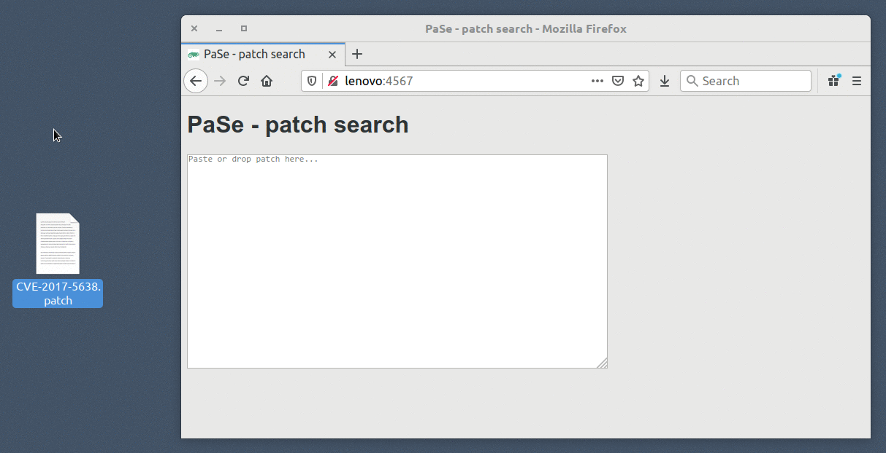

# PaSe

Pa(tch)Se(arch) is an experimental search engine for code allowing search by patch.

It will return files by applicability of a specified patch.

## Indexing

To index a source directory:
```
java -jar pase.jar index <source_path> <index_path>
```

## Searching

Once indexing has finished, you can search:

- **on the command line**: use `java -jar pase.jar search <index_path> <patch_path>`
- **via API**:
  - use `java -jar pase.jar serve <index_path>` to start the PaSe Server
  - query the URL `http://localhost:4567/search?patch=URL_ENCODED_PATCH` to get results as JSON (see `utils/example_client.py` for a full example)
- **via the Web UI**:
  - use `java -jar pase.jar serve <index_path>` to start the PaSe Server
  - visit [http://localhost:4567](http://localhost:4567) with your browser


